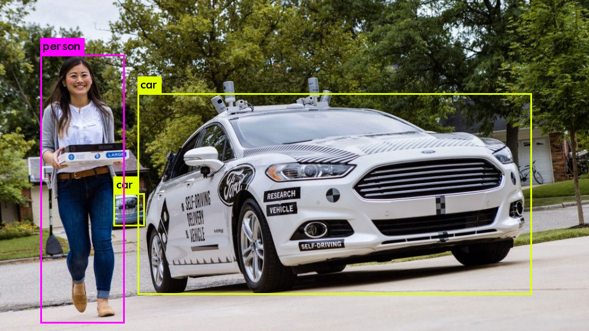

# You Only Look Once

YOLO is an acronym of "you only look once". It is an object detection system targeted for real-time processing.

YOLO applies a single neural network to the full image. This network divides the image into regions and predicts bounding boxes and probabilities for each region. These bounding boxes are weighted by the predicted probabilities. Finally, we can threshold the detections by some value to only see high scoring detections.

This project presents a tutorial for detecting objects in both images in videos with the YOLO system and using a pre-trained model. To do so will explore Darknet and ImageAI.

## Darknet

Darknet is an open source neural network framework written in C and CUDA. It is fast, easy to install, and supports CPU and GPU computation. [Web Site](https://pjreddie.com/darknet/) [Github](https://github.com/pjreddie/darknet)

## ImageAI

ImageAI is a python library built to empower developers to build applications and systems with self-contained Deep Learning and Computer Vision capabilities using simple and few lines of code.

ImageAI provided very powerful yet easy to use classes and functions to perform Video Object Detection and Tracking and Video analysis. It allows you to perform all of these with state-of-the-art deep learning algorithms like RetinaNet, YOLOv3 and TinyYOLOv3. [ImageAI documentation](https://imageai.readthedocs.io/en/latest/video/index.html)

## Detection example

  

